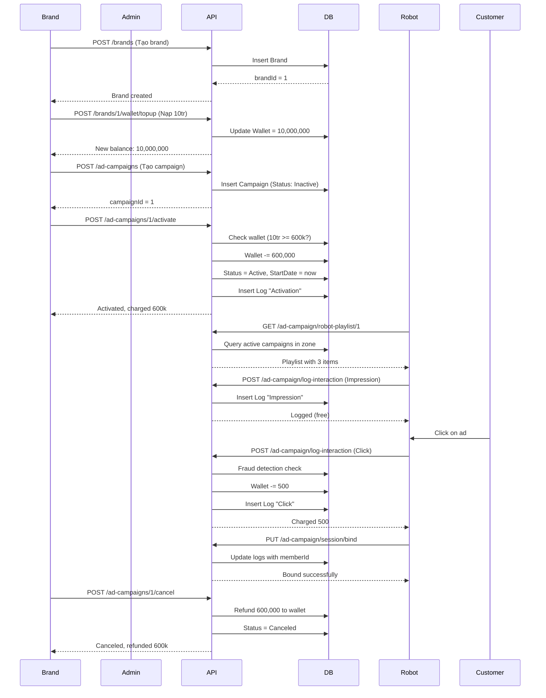
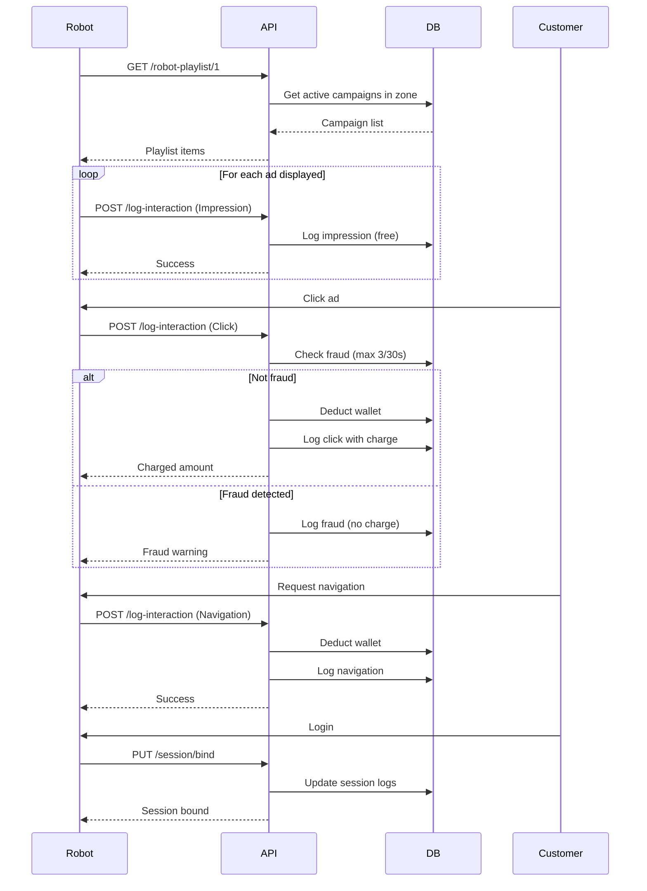
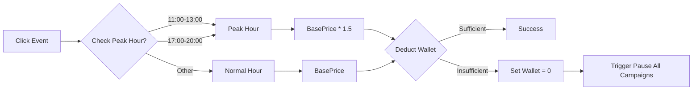

# SmartMarketBot - Advertising System Flow Documentation

## 📋 Mục lục

1. [Tổng quan hệ thống](#tổng-quan-hệ-thống)
2. [Luồng chính (Main Flow)](#luồng-chính-main-flow)
3. [Chi tiết từng chức năng](#chi-tiết-từng-chức-năng)
4. [Sequence Diagrams](#sequence-diagrams)
5. [State Transitions](#state-transitions)
6. [Dependencies & Prerequisites](#dependencies--prerequisites)

---

## Tổng quan hệ thống

Hệ thống quảng cáo của SmartMarketBot được chia thành 2 phần chính:

```
┌─────────────────────────────────────────────────────────────────┐
│                      BRAND / ADMIN SIDE                         │
│  (Quản lý chiến dịch, sản phẩm, tài nguyên, ví)                │
├─────────────────────────────────────────────────────────────────┤
│  Brands → AdPackages → AdCampaigns → SponsoredProducts         │
│           → AdResources → Activation/Pause/Cancel               │
└─────────────────────────────────────────────────────────────────┘
                              ↓
┌─────────────────────────────────────────────────────────────────┐
│                      ROBOT / CUSTOMER SIDE                      │
│  (Tương tác thực tế với khách hàng)                             │
├─────────────────────────────────────────────────────────────────┤
│  RobotPlaylist → Impression → Click → Navigation               │
│                 → SessionBind → FraudDetection                  │
└─────────────────────────────────────────────────────────────────┘
```

---

## Luồng chính (Main Flow)

### 🎯 Flow 1: Khởi tạo & Kích hoạt chiến dịch (Brand Side)

```
[1. Tạo Brand]
    ↓
[2. Nạp tiền ví]
    ↓
[3. Tạo Ad Package] (hoặc dùng package có sẵn)
    ↓
[4. Tạo Ad Campaign]
    ↓
[5. Thêm Sponsored Products]
    ↓
[6. Upload Ad Resources]
    ↓
[7. Activate Campaign] ← Trừ tiền ví
    ↓
[8. Monitor Logs & Metrics]
```

**Thứ tự bắt buộc:**
- **Bước 1 → 2**: Brand phải có ví đủ tiền trước khi activate
- **Bước 3 → 4**: Campaign cần Package và Brand đã tồn tại
- **Bước 4 → 5**: Campaign phải được tạo trước khi thêm sản phẩm
- **Bước 7**: Chỉ kích hoạt được khi campaign đang `Inactive`

---

### 🤖 Flow 2: Vòng đời Robot (Robot Side)

```
[Robot lấy Playlist]
    ↓
[Hiển thị Impression] → Ghi nhận (miễn phí)
    ↓
[Khách Click] → Ghi nhận + Trừ tiền Brand
    ↓
[Robot dẫn đường] → Ghi nhận Navigation
    ↓
[Khách đăng nhập] → Bind Session
```

**Thứ tự bắt buộc:**
- **Playlist → Impression**: Robot cần biết hiển thị gì trước
- **Session Bind**: Có thể thực hiện bất cứ lúc nào sau khi có session

---

## Chi tiết từng chức năng

### 1. Brand Management

#### 1.1 Tạo Brand
```
POST /api/v1/brands
Body: {
  "brandName": "Coca-Cola Vietnam",
  "description": "Thương hiệu nước giải khát"
}
↓
Response: brandId (VD: 1)
↓
Next: Nạp tiền ví
```

#### 1.2 Nạp tiền ví
```
POST /api/v1/brands/{brandId}/wallet/topup
Body: {
  "amount": 10000000
}
↓
Response: newBalance (VD: 10,000,000)
↓
Next: Tạo/Chọn Ad Package
```

**Lưu ý:**
- Mỗi lần activate campaign sẽ trừ: `PricePackage + PriceRoute`
- Mỗi click sẽ trừ: `BasePriceClick` (1.5x nếu peak hour)

---

### 2. Ad Package Management

#### 2.1 Xem danh sách Packages
```
GET /api/v1/ad-packages
↓
Response: [
  {
    "packageId": 1,
    "packageName": "Basic Package",
    "pricePackage": 500000,    ← Tiền kích hoạt
    "priceRoute": 100000,      ← Tiền định tuyến
    "basePriceClick": 500,     ← Tiền mỗi click
    "adScore": 50,             ← Điểm ưu tiên hiển thị
    "status": "Active"
  }
]
↓
Next: Tạo Campaign với packageId
```

#### 2.2 Tạo Package mới (Optional)
```
POST /api/v1/ad-packages
Body: {
  "packageName": "Premium Package",
  "pricePackage": 1000000,
  "priceRoute": 200000,
  "basePriceClick": 1000,
  "adScore": 100
}
↓
Response: packageId
↓
Next: Tạo Campaign
```

---

### 3. Ad Campaign Management

#### 3.1 Tạo Campaign
```
POST /api/v1/ad-campaigns
Body: {
  "brandId": 1,
  "packageId": 1,
  "campaignName": "Summer Sale 2026",
  "startDate": "2026-06-21T00:00:00Z",
  "endDate": "2026-08-21T23:59:59Z",
  "productIds": [1, 2, 3]  // Optional
}
↓
Response: {
  "adCampaignId": 1,
  "status": "Inactive",  // ← Chưa kích hoạt
  "sponsoredProductCount": 3
}
↓
Next: Thêm Sponsored Products (nếu chưa có)
```

#### 3.2 Tạo Campaign + Sponsored Products (Recommended)
```
POST /api/v1/ad-campaigns/with-products
Body: {
  "brandId": 1,
  "packageId": 1,
  "campaignName": "Summer Sale with Products",
  "startDate": "2026-06-21T00:00:00Z",
  "endDate": "2026-08-21T23:59:59Z",
  "productIds": [1, 2, 3, 4, 5]  // Bắt buộc
}
↓
Response: adCampaignId + sponsored products được tạo
↓
Next: Upload Ad Resources
```

#### 3.3 Thêm Sponsored Products (Bulk)
```
POST /api/v1/sponsored-products/bulk
Body: {
  "adCampaignId": 1,
  "products": [
    { "productId": 6, "priority": 100 },
    { "productId": 7, "priority": 90 }
  ]
}
↓
Next: Upload Ad Resources
```

#### 3.4 Upload Ad Resources
```
POST /api/v1/ad-resources/upload (multipart/form-data)
Body:
  - AdCampaignId: 1
  - ResourceType: "Image" | "Video"
  - File: [file]
  - Resolution: "1920x1080"

HOẶC

POST /api/v1/ad-resources
Body: {
  "adCampaignId": 1,
  "resourceType": "Image",
  "resourceUrl": "https://example.com/ad.jpg",
  "contentText": "Summer Sale!",
  "resolution": "1920x1080"
}
↓
Next: Activate Campaign
```

#### 3.5 Activate Campaign ⭐ (QUAN TRỌNG)
```
POST /api/v1/ad-campaigns/{campaignId}/activate
↓
KIỂM TRA:
✓ Campaign đang Inactive?
✓ Brand có đủ tiền? (PricePackage + PriceRoute)
↓
XỬ LÝ:
- Trừ tiền: PricePackage + PriceRoute
- Tạo log: "Activation" với ChargedAmount
- Set Status = "Active"
- Set StartDate = now
↓
Response: {
  "adCampaignId": 1,
  "previousStatus": "Inactive",
  "newStatus": "Active",
  "amountCharged": 600000,
  "remainingWalletBalance": 4400000
}
↓
Next: Robot lấy Playlist
```

#### 3.6 Pause Campaign
```
POST /api/v1/ad-campaigns/{campaignId}/pause
Body: {
  "reason": "Hết hàng tồn kho"
}
↓
KIỂM TRA:
✓ Campaign đang Active?
↓
XỬ LÝ:
- Set Status = "Paused"
- Tạo log: "Paused"
↓
Response: {
  "adCampaignId": 1,
  "newStatus": "Paused",
  "reason": "Hết hàng tồn kho"
}
↓
Next: Có thể Activate lại
```

#### 3.7 Cancel Campaign (Hoàn tiền)
```
POST /api/v1/ad-campaigns/{campaignId}/cancel
↓
KIỂM TRA:
✓ Campaign chưa Completed/Canceled?
↓
XỬ LÝ:
- Nếu đang Active: Hoàn tiền = tổng ChargedAmount của logs "Activation"
- Set Status = "Canceled"
- Tạo log: "Canceled" với ChargedAmount = -refundedAmount
↓
Response: {
  "adCampaignId": 1,
  "newStatus": "Canceled",
  "refundedAmount": 600000
}
```

---

### 4. Robot Integration

#### 4.1 Robot lấy Playlist
```
GET /api/v1/ad-campaign/robot-playlist/{robotId}
↓
LẤY DỮ LIỆU:
- Robot hiện tại đang ở Zone nào
- Tất cả SponsoredProducts thuộc Campaign Active trong Zone
- AdResources đang Active của Campaign
↓
LỌC:
✓ Campaign Status = Active
✓ StartDate <= now <= EndDate
✓ SponsoredProduct Status = Active
↓
SẮP XẾP:
1. AdScore (cao → thấp)
2. Priority (cao → thấp)
3. EndDate (gần → xa)
↓
Response: {
  "robotId": 1,
  "currentZoneId": 3,
  "items": [
    {
      "sponsoredId": 1,
      "adCampaignId": 1,
      "productId": 1,
      "productName": "Coca Cola 330ml",
      "priority": 100,
      "adScore": 50,
      "endDate": "2026-07-21T23:59:59Z",
      "mediaContents": [
        {
          "resourceType": "Image",
          "resourceUrl": "https://...",
          "contentText": "Summer Sale!"
        }
      ]
    }
  ]
}
↓
Next: Hiển thị quảng cáo → Log Impression
```

#### 4.2 Log Impression (Hiển thị)
```
POST /api/v1/ad-campaign/log-interaction
Body: {
  "adCampaignId": 1,
  "sponsoredId": 1,
  "productId": 1,
  "robotId": 1,
  "robotZoneId": 3,
  "zoneId": 3,
  "slotId": 5,
  "sessionId": "robot-session-001",
  "actionType": "Impression",
  "xCoord": 10.5,
  "yCoord": 20.3
}
↓
XỬ LÝ:
- Tạo log: "Impression"
- ChargedAmount = 0 (miễn phí)
↓
Response: {
  "success": true,
  "logId": 2,
  "chargedAmount": 0,
  "isFraud": false
}
↓
Next: Chờ khách Click
```

#### 4.3 Log Click (Khách nhấn)
```
POST /api/v1/ad-campaign/log-interaction
Body: {
  "adCampaignId": 1,
  "sponsoredId": 1,
  "productId": 1,
  "robotId": 1,
  "sessionId": "robot-session-001",
  "actionType": "Click"
}
↓
KIỂM TRA:
✓ Campaign đang Active?
↓
FRAUD DETECTION:
- Đếm số Click trong 30s của session/member
- Nếu >= 3: Đánh dấu Fraud (không trừ tiền)
↓
TÍNH TIỀN:
- BasePriceClick = 500
- Nếu Peak Hour (11-13h, 17-20h): 500 * 1.5 = 750
↓
TRỪ TIỀN:
- Lock Wallet
- Brand.Wallet -= chargedAmount
- Nếu Wallet <= 0: Trigger ProcessWalletLowBalance (pause all campaigns)
↓
TẠO LOG:
- ActionType = "Click" (hoặc "FraudDetected")
- ChargedAmount = tiền đã trừ
↓
Response: {
  "success": true,
  "logId": 3,
  "chargedAmount": 500,
  "isFraud": false
}
↓
Next: Log Navigation (nếu robot dẫn đường)
```

#### 4.4 Log Navigation (Dẫn đường)
```
POST /api/v1/ad-campaign/log-interaction
Body: {
  "adCampaignId": 1,
  "sponsoredId": 1,
  "productId": 1,
  "robotId": 1,
  "actionType": "Navigation"
}
↓
XỬ LÝ:
- Tạo log: "Navigation"
- Trừ tiền = BasePriceClick (giống Click)
↓
Response: {
  "success": true,
  "logId": 4,
  "chargedAmount": 500,
  "isFraud": false
}
```

#### 4.5 Session Bind (Gán Member)
```
PUT /api/v1/ad-campaign/session/bind
Body: {
  "memberId": 1,
  "sessionId": "robot-session-001"
}
↓
KIỂM TRA:
✓ Member tồn tại?
↓
TÌM LOGS:
- Tìm các log có SessionId = "robot-session-001"
- Và MemberId = null (chưa gán)
- Trong vòng 30s gần đây
↓
CẬP NHẬT:
- Gán MemberId cho tất cả logs tìm được
↓
Response: {
  "logsUpdated": 3,
  "memberId": 1,
  "sessionId": "robot-session-001",
  "message": "Session bound successfully. Updated 3 logs."
}
```

---

### 5. Route Impression

#### 5.1 Tự động ghi Impression theo Zone
```
POST /api/v1/ad-campaign/route-impression
Body: {
  "slotId": 5,
  "xCoord": 100,
  "yCoord": 200,
  "memberId": 1
}
↓
TÌM ZONE:
- Lấy Zone chứa SlotId = 5
↓
TÌM CAMPAIGNS:
- Tất cả Campaign Active trong Zone đó
- Đang trong thời gian chạy (StartDate <= now <= EndDate)
↓
TẠO LOGS:
- Mỗi Campaign → 1 log "Impression"
- Gắn SponsoredProducts liên quan
↓
Response: {
  "robotCode": "ROBOT-001",
  "slotId": 5,
  "zoneId": 3,
  "impressionCount": 2,
  "totalChargedAmount": 0,
  "logs": [
    { "sponsoredId": 1, "productId": 1, "adCampaignId": 1, "chargedAmount": 0 },
    { "sponsoredId": 2, "productId": 2, "adCampaignId": 2, "chargedAmount": 0 }
  ]
}
```

---

## Sequence Diagrams

### Diagram 1: Campaign Lifecycle



### Diagram 2: Robot Interaction Flow



### Diagram 3: Peak Hour Pricing



---

## State Transitions

### Campaign Status Flow

```
┌──────────┐
│ Inactive │ ← Tạo mới
└────┬─────┘
     │ Activate
     ↓
┌──────────┐
│  Active  │ ← Đang chạy
└────┬─────┘
     │
     ├──→ Pause ──→ Active (có thể resume)
     │
     ├──→ EndDate hết hạn ──→ Completed (tự động)
     │
     ├──→ Cancel ──→ Canceled (hoàn tiền)
     │
     └──→ Wallet hết tiền ──→ Paused (tự động)
```

### Sponsored Product Status

```
Active ↔ Inactive
```

**Cho phép:**
- Campaign `Inactive`: Có thể sửa/xóa campaign
- Campaign `Active`: Chỉ được xem logs
- Campaign `Paused`: Có thể Activate lại
- Campaign `Canceled/Completed`: Không thể thay đổi

---

## Dependencies & Prerequisites

### Bắt buộc trước khi test

| Thứ tự | Chức năng | Yêu cầu trước |
|--------|-----------|---------------|
| 1 | Create Brand | - |
| 2 | Top Up Wallet | Brand tồn tại |
| 3 | Create Package | - (hoặc dùng mặc định) |
| 4 | Create Campaign | Brand + Package tồn tại |
| 5 | Add Products | Campaign tồn tại |
| 6 | Upload Resources | Campaign tồn tại |
| 7 | Activate | Campaign Inactive + Ví đủ tiền |
| 8 | Robot Playlist | Campaign Active + Robot tồn tại |
| 9 | Log Interaction | Campaign Active |
| 10 | Session Bind | Member + Session tồn tại |

### Giá tiền theo gói

```
TỔNG TIỀN KÍCH HOẠT = PricePackage + PriceRoute

VÍ DỤ:
- Package A: PricePackage = 500,000, PriceRoute = 100,000
- Khi Activate: Trừ 600,000 từ ví Brand

TIỀN MỖI CLICK = BasePriceClick

VÍ DỤ:
- BasePriceClick = 500
- Peak Hour (11-13h, 17-20h): 500 * 1.5 = 750
- Normal Hour: 500
```

---

## Quick Reference: API Endpoints

### Brands
```
GET    /api/v1/brands                      # Danh sách
GET    /api/v1/brands/{id}                 # Chi tiết
POST   /api/v1/brands                      # Tạo mới
PUT    /api/v1/brands/{id}                 # Cập nhật
DELETE /api/v1/brands/{id}                 # Xóa
POST   /api/v1/brands/{id}/wallet/topup    # Nạp tiền
POST   /api/v1/brands/{id}/deposit         # Admin nạp tiền
```

### Ad Packages
```
GET    /api/v1/ad-packages                 # Danh sách
GET    /api/v1/ad-packages/{id}            # Chi tiết
POST   /api/v1/ad-packages                 # Tạo mới
PUT    /api/v1/ad-packages/{id}            # Cập nhật
DELETE /api/v1/ad-packages/{id}            # Xóa
```

### Ad Campaigns
```
GET    /api/v1/ad-campaigns                # Danh sách (phân trang)
GET    /api/v1/ad-campaigns/{id}           # Chi tiết
POST   /api/v1/ad-campaigns                # Tạo mới
POST   /api/v1/ad-campaigns/with-products  # Tạo + sản phẩm
PUT    /api/v1/ad-campaigns/{id}           # Cập nhật (chỉ Inactive)
DELETE /api/v1/ad-campaigns/{id}           # Xóa (chỉ Inactive)
POST   /api/v1/ad-campaigns/{id}/activate  # Kích hoạt
POST   /api/v1/ad-campaigns/{id}/pause     # Tạm dừng
POST   /api/v1/ad-campaigns/{id}/cancel    # Hủy + hoàn tiền
GET    /api/v1/ad-campaigns/{id}/logs      # Lịch sử logs
```

### Sponsored Products
```
GET    /api/v1/sponsored-products/campaign/{id}  # Theo campaign
GET    /api/v1/sponsored-products/{id}            # Chi tiết
POST   /api/v1/sponsored-products                 # Thêm 1 sản phẩm
POST   /api/v1/sponsored-products/bulk            # Thêm nhiều
PUT    /api/v1/sponsored-products/{id}/priority   # Đổi priority
PATCH  /api/v1/sponsored-products/{id}/status     # Đổi status
DELETE /api/v1/sponsored-products/{id}            # Xóa
```

### Ad Resources
```
GET    /api/v1/ad-resources/campaign/{id}     # Theo campaign
GET    /api/v1/ad-resources/{id}              # Chi tiết
POST   /api/v1/ad-resources                   # Tạo (URL)
POST   /api/v1/ad-resources/upload            # Upload file
PATCH  /api/v1/ad-resources/{id}/status       # Đổi status
DELETE /api/v1/ad-resources/{id}              # Xóa
```

### Robot & Interaction
```
GET    /api/v1/ad-campaign/robot-playlist/{robotId}  # Lấy playlist
POST   /api/v1/ad-campaign/log-interaction           # Ghi tương tác
PUT    /api/v1/ad-campaign/session/bind              # Gán session
POST   /api/v1/ad-campaign/route-impression          # Route impression
```

---

## Test Scenarios

### Scenario 1: Happy Path (Trường hợp tốt)
```
1. Tạo Brand → Top Up 10tr
2. Tạo Campaign với 5 sản phẩm
3. Upload 2 hình ảnh
4. Activate → Trừ 600k
5. Robot lấy playlist → Hiển thị
6. Log Impression → Miễn phí
7. Log Click → Trừ 500
8. Bind Session
9. Cancel Campaign → Hoàn 600k
```

### Scenario 2: Peak Hour Pricing
```
1. Tạo Brand + Top Up
2. Tạo Campaign + Activate
3. Click lúc 12:00 (peak) → Trừ 750 (1.5x)
4. Click lúc 15:00 (normal) → Trừ 500
5. So sánh logs
```

### Scenario 3: Fraud Detection
```
1. Tạo Campaign + Activate
2. Click 1 (OK)
3. Click 2 (OK)
4. Click 3 (OK)
5. Click 4 trong 30s → FRAUD (không trừ tiền)
6. Chờ 30s
7. Click 5 → OK (reset)
```

### Scenario 4: Wallet Empty
```
1. Tạo Brand + Top Up 1000
2. Tạo Campaign + Activate (trừ 600)
3. Click 1 lần (trừ 500) → Wallet = 0
4. Auto-pause tất cả campaigns của brand
5. Thử click nữa → Campaign không Active
```

### Scenario 5: Route Impression
```
1. Tạo Campaign trong Zone 3
2. Robot ở Zone 3 gọi route-impression
3. Tự động ghi Impression cho tất cả Campaign trong Zone
4. Kiểm tra logs
```

---

## Notes

- **Timezone**: Tất cả thời gian dùng UTC
- **Peak Hours**: 11:00-13:00 UTC và 17:00-20:00 UTC
- **Fraud Window**: 30 giây
- **Max Clicks**: 3 clicks/session/30s
- **Wallet Lock**: Thread-safe với Lock object
- **Transaction**: Dùng transaction cho tất cả thao tác ví quan trọng

---

## Troubleshooting

| Lỗi | Nguyên nhân | Giải pháp |
|------|-------------|-----------|
| "Insufficient wallet balance" | Ví không đủ tiền | Top up thêm |
| "Campaign not editable" | Campaign đang Active/Paused | Chuyển về Inactive |
| "Cannot delete active campaign" | Campaign đang chạy | Pause hoặc Cancel trước |
| "Campaign not in Inactive status" | Status không phải Inactive | Kiểm tra status hiện tại |
| "Products not found" | ProductId không tồn tại | Kiểm tra lại ID |
| "Fraud detected" | Click quá nhanh | Chờ 30s rồi thử lại |

---

*Generated for SmartMarketBot BE - Advertising System*
*Last updated: 2026-06-22*
